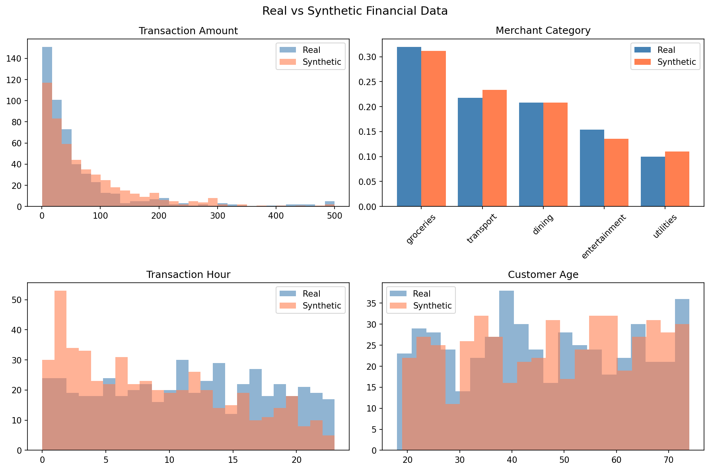

# YC-Synth: High-Fidelity Synthetic Data for Fintech

**YC-Synth is an early-stage project to create a production-grade synthetic data generation engine for financial services.**

The financial industry runs on data, but using that data is difficult, dangerous, and slow due to privacy regulations (GDPR, CCPA), security risks, and technical complexity.

We provide a solution that allows developers, data scientists, and engineers to generate high-fidelity, statistically accurate synthetic data that is safe to use and share.

---

## The Problem

Financial institutions need high-quality data to:
*   Train machine learning models (for fraud detection, credit risk, etc.)
*   Test software and infrastructure at scale.
*   Share data with internal teams or external partners for research.

Using real customer data is a nightmare. It requires months of compliance approvals, expensive data anonymization pipelines, and still carries the risk of data breaches, which can lead to multi-million dollar fines. As a result, innovation is slow and risky.

## Our Solution: Synthesis-as-a-Service

Our core technology uses a novel, two-pronged approach to generate synthetic data that accurately captures the complexities of real-world financial transactions:

1.  **Quantile Transformation**: We preprocess heavy-tailed distributions (like transaction amounts) into a normal distribution. This allows our underlying Generative Adversarial Network (GAN) to learn the data's structure far more effectively than standard approaches.
2.  **Stratified Training**: We train separate models on different data segments (e.g., fraudulent vs. legitimate transactions). This ensures that rare but critical patterns are learned with high fidelity. We then blend the results back at the correct real-world rate.

This results in synthetic data that preserves both the marginal distributions and the subtle correlations of the original dataset, without leaking private information.

---

## Interactive Demo

We have built a simple interactive demo to showcase the core engine.

**To run the demo:**

1.  **Install dependencies:**
    ```bash
    pip install streamlit pandas numpy sdv
    ```

2.  **Run the Streamlit app:**
    ```bash
    streamlit run synthetic_fintech/app.py
    ```

This will launch a web interface where you can generate and evaluate a synthetic dataset in real-time.



---

## The Vision

Our goal is to build the "Stripe for Synthetic Data". We will provide a simple, developer-first API that allows any company—from a two-person startup to a bulge-bracket bank—to generate safe, high-quality data in minutes, not months.

This will unlock faster innovation, more robust systems, and a new wave of data-driven products in the financial sector.

## The Team

_(Founders with deep expertise in both machine learning and financial infrastructure)._
